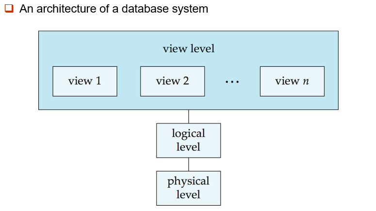
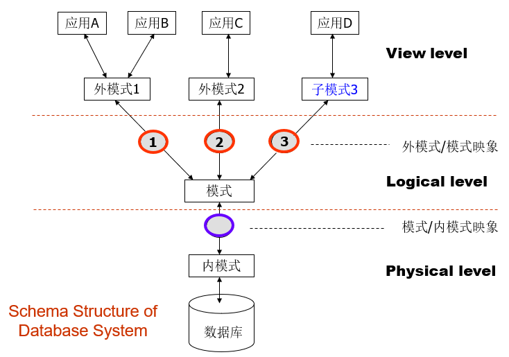
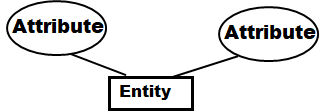
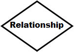
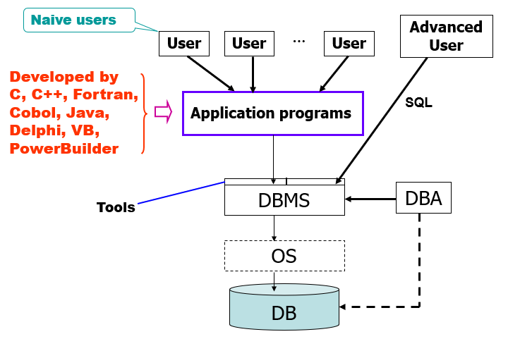
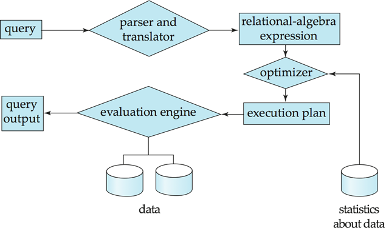
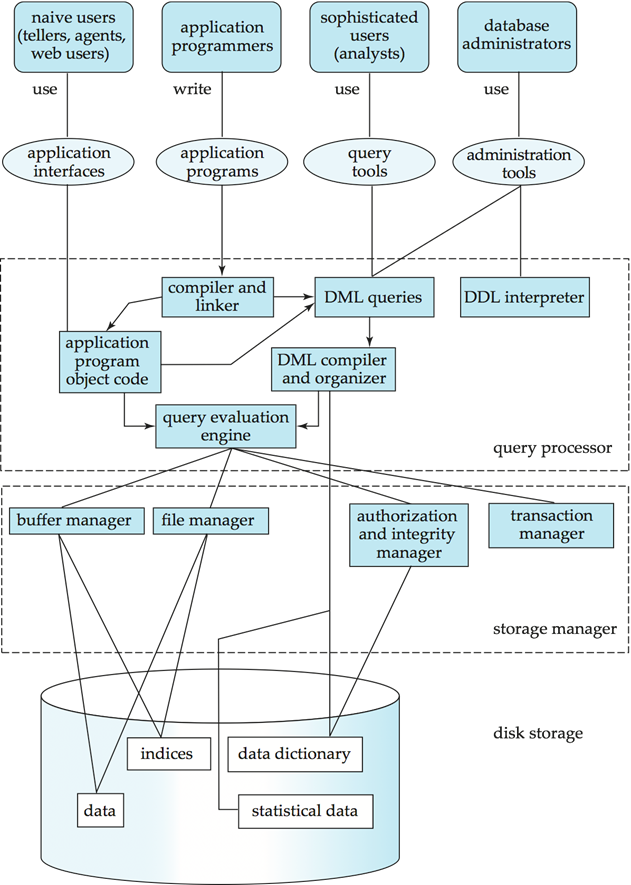
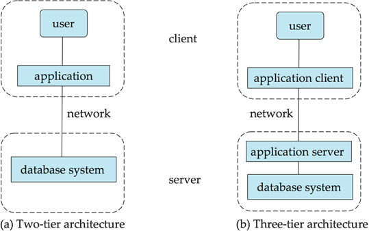

# WEEK 1

## 1 Introduction - Database System

### 1.1 Purpose of Database Systems 

#### 1.1.1 Database Applications 

- Data processing and management are the most important fields of computer applications
- Applications
  - Banking: all transactions
  - Airlines: reservations, schedules
  - Universities: registration, grades
  - Sales: customers, products, purchases
  - Manufacturing: production, inventory, orders, supply chain
  - Human resources: employee records, salaries, tax deductions 

#### 1.1.2 Several Concepts 

- Database
  - A collection of interrelated data, relevant to an enterprise
  - A large collection of integrated and persistent data (DB)
  - A collection of information that exists over a long period of time, often many years
  - 长期存储在计算机内、有组织的、可共享的数据集合
- Database Management System (DBMS)
  - ( Database ) + A set of programs used to access, update and manage the data in database

#### 1.1.3 Database System vs. File-Processing System 

- Characteristics of DBMS
  - Efficiency and scalability in **data access**
  - Reduced **application development time**
  - Data **independence** (including physical data independence and logical data independence).
  - Data **integrity** and **security**
  - **Concurrent** access and **robustness**

- File-processing system is supported by a conventional Operating System (OS)
  - New application programs must be written if necessary, and new data files are created as required
  - But over a long period of time, data files may be in different formats
  - Data files are independent each other
- Drawbacks of File-Processing System
  - Data redundancy and inconsistency
  - Difficulty in accessing data
  - Data isolation — multiple files and multiple formats
  - Integrity problems
  - No **atomicity(原子性)** of updates
  - Difficult to **concurrent access(并发访问)** by multiple users
  - **Security problems**
- The DBMS Marketplace
  - Relational DBMS companies: Oracle, Sybase, IBM DB2, Microsoft SQL-Server, Microsoft Access
  - Relational database (DB) companies are also challenged by object-oriented DB companies
  - But countered with object-relational systems, which retain the relational core while allowing type extension as in object-oriented (OO) systems
  - Other database products: Foxbase, FoxPro, dBase, Ingres,  Paradox, …
  - Open source databases: MySQL, PostgreSQL

### 1.2 View of Data

#### 1.2.1 Level of Data Abstraction 

- How to use DB --- Different usage needs different level of abstraction. 
  - **Physical level**: describes how a record is stored
  - **Logical level**: describes data stored in database, and the relationships among the data on upper level
  - **View level**: application programs hide details of data types. Note that views can also hide information (e.g., employee’s salary) for security purposes

#### 1.2.2 Schemas and Instances

- Schema – the structure of the database on different level
  - Analogous to type information of a variable in a program
  - **Physical schema**: database structure design at the physical level 
  - **Logical schema**: database structure design at the logical level 
  - **Subschema**: schema at view level
- Instance – the actual content of the database at a particular point in time 
  - Analogous to the value of a variable

#### 1.2.3 Physical Independence vs. Logical Independence

- Ability to modify a schema definition at one level without affecting a schema definition at a higher level. 
- Physical data independence – the ability to modify the physical schema without changing the logical schema
  - Applications depend on the logical schema
  - Applications are insulated from how data is structured and stored
  - One of the most important benefits of using a DBMS
- Logical data independence – protect application programs from changes in logical structure of data
  - Logical data independence is hard to achieve as the application programs are heavily dependent on the logical structure of data

#### 1.2.4 Data Models

- Data model is a collection of conceptual tools for describing 
  - data structure
  - data relationships
  - data semantics
  - data constraints 
- Different level of data abstraction needs different data model to describe 
  - Entity-Relationship model
  - Relational model
  - Other models: Object-oriented model, Semi-structured data models (XML), Older models such as network model, hierarchical model, etc. 

### 1.3 Database Language

#### 1.3.1 Data Definition Language (DDL) 

- Specifies a **database scheme** as a set of definitions of **relational schema**
- Also specifies **storage structure**, **access methods**, and **consistency constraints**
- DDL statements are compiled, resulting in a set of tables stored in a special file called **data dictionary**
- Data dictionary contains metadata (i.e., the data about data) about Database schema， Integrity constraints(Primary Key, Referential integrity),  Authorization

#### 1.3.2 Data Manipulation Language (DML) 

- Retrieve data from the database 
- Insert/delete/update data in the database 
- DML also known as query language
- Two classes of DMLs
  - Procedural DML: user specifies what data is required and how to get those data
  - Nonprocedural DML: user specifies what data is required without specifying how to get those data

#### 1.3.3 SQL

- SQL = DDL+DML+DCL
- **Structured English Query Language (SEQUEL)**
- SQL is the most widely used **non-procedural** query language
- Three classes of SQL usage: interactive environment, host language through ODBC/JDBC, host language with embed-SQL

### 1.4 Database Design

#### 1.4.1 Steps of Database Design

- Requirement analysis
  - What data, applications, and operations needed. 
- Conceptual database design 
  - A high-level description of data, constraints using Entity-Relationship (E-R) model or a similar high level data model. 
- Logical database design
  - Convert the conceptual design into a DB schema. 
- Schema refinement 
  - Normalization of relations: Check relational schema for redundancies and related anomalies. 
- Physical database design
  - Indexing, query, clustering, and database tuning. 
- Create and initialize the database & Security design
  - Load initial data, testing. 
  - Identify different user groups and their roles. 

#### 1.4.2 Entity-Relationship Model

- E-R model of real world

  - **Entities**(object)

    

  - **Relationships** between entities

    

#### 1.4.3 Relational Model

- Transfer E-R diagrams into relational schema

### 1.5 Database Users and Administrators

#### 1.5.1 Database Users

- Naive users – invoke one of the permanent application programs that have been written previously by a high level language. 
- Application programmers – interact with system via SQL calls. 
- Sophisticated users – form requests in a database query language. 
- Specialized users – write specialized database applications that do not fit into the traditional data processing framework.

#### 1.5.2 Database Administrators

- **Database administrator(DBA)**: A special user having central control over database and programs accessing those data. 
- DBA has the **highest privilege** for the database. 
- DBA **coordinates** all the activities of the database system. 
- DBA **controls all users authority** to the database. 
- DBA has a good understanding of the enterprise’s information resources and requirements
- Database administrator's duties/functions include: 
  - Schema definition 
  - Storage structure and access method definition 
  - Schema and physical organization modification 
  - Granting of authorization for data access 
  - Routing maintenance

### 1.6 Transaction Management

- Concurrent use/access is important, but causes problems/conflict
- A transaction is a collection of operations that performs a single logical function in a database application
- Transaction requirements include **atomicity(原子性), consistence(一致性), isolation(隔离性), durability(持久性)**
- Transaction-management component ensures that the database remains in a consistent (or correct) state, although system failures (e.g., power failures and operating system crashes) and transaction failures - by backup and recovery subsystem
- Concurrency-control manager controls the interaction among the concurrent transactions

### 1.7 Database Architecture

#### 1.7.1 Storage Manager

- Storage Manager is a program module that provides the interface between the low-level data stored in the database and the application programs and queries submitted to the system
- Storage Manager is responsible for the following tasks
  - Interaction with the file manager 
  - Efficient storing, retrieving and updating of data
- Storage Manager includes 
  - Transaction manager 
  - Authorization and integrity manger 
  - File manager (interaction with the file system to process data files, data dictionary, and index files) 
  - Buffer manager

#### 1.7.2 Query Processor

- Query Processor includes DDL interpreter, DML compiler, and query processing

  - Parsing and translation 
  - Optimization 
  - Evaluation

  

- Query Processing Optimization

  - Alternative ways of evaluating a given query
    - Equivalent expressions
    - Different algorithms for each operation
  - Cost difference between a good and a bad way of evaluating a query can be enormous
  - Need to estimate the cost of operations
    - Depends critically on statistical information about relations which the database must maintain
    - Need to estimate statistics for intermediate results to compute cost of complex expressions

#### 1.7.3 Database System Internals

#### 1.7.4 Database Architecture

- The architecture of a database system is greatly influenced by the underlying computer system on which the database is running: 

  - Centralized
  - Client-server
  - Parallel (multi-processor)
  - Distributed 

  
