# WEEK 2

## 2 Relation model

- The relational model is very simple and elegant. 
- A relational database is a collection of one or more relations, which are based on the relational model. 
- A relation is a table with rows and columns. 
- The major advantages of the relational model are its straightforward data representation and the ease with which even complex queries can be expressed. 
- Owing to the great language SQL, the most widely used language for creating, manipulating, and querying relational database. 

### 2.1 Structure of Relational Databases

####  2.1.1 Basic Structure

- given sets $D_1, D_2, …, D_n  (D_i = a_{ij | j=1…k})$, a relation $r$ is a subset of $D_1 \times D_2 \times … \times D_n$ 
     --- **a Cartesian product** (笛卡儿积) of a list of domain $D_i$ 
- a **relation is a set of $n$-tuples ($a_{1j}, a_{2j}, …, a_{nj}$)**, where each $a_{ij} \in  D_i  (i \in [1, n])$.

#### 2.1.2 Attribute Types

- Each attribute of a relation has a name. 
- The set of allowed values for each attribute is called the domain (域)  of the attribute. 
- Attribute values are (normally) required to be atomic
  - indivisible (--- 1st NF, 关系理论第一范式) 
  - multivalued attribute values are not atomic
  - composite attribute values are not atomic
- The special value null is a member of every domain. 
- The null value causes complications in the definition of many operations

#### 2.1.3 Concepts about Relation

- A relation is concerned with two concepts: relation schema and relation instance. 
- The relation schema describes the structure of the relation.
- The relation instance corresponds to the snapshot of the data in the relation at a given instant in time. 

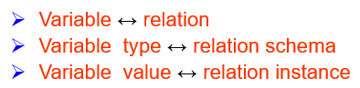

#### 2.1.4 Relation Schema

- Assume $A_1, A_2, …, A_n$ are attributes, formally expressed: $R = (A_1, A_2, …, A_n)$ is a relation schema 
- $r(R)$ is a relation on the relation schema $R$

#### 2.1.5 Relation Instance

- The current values of a relation are specified by a table
- An element $t$ of $r$ is a **tuple**, represented by a **row** in a table
- Let a **tuple variable** $t$ be a tuple, then $t[name]$ denotes the value of $t$ on the name attribute

#### 2.1.6 The Properties of Relation

- The order of tuples is irrelevant
- No duplicated tuples in a relation
- Attribute values are atomic

#### 2.1.6 Database

- A database consists of multiple relations

#### 2.1.7 Key

- Let $K\sube R$
- $K$ is a **superkey (超码)** of $R$ if values for $K$ are **sufficient** to identify a unique tuple of each possible relation $r(R)$ 
- $K$ is a **candidate key (候选码)** if $K$ is **minimal superkey**
- $K$ is a **primary key (主码)**, if $K$ is a candidate key and is **defined by user explicitly**
  - Primary key is usually **marked by underline**

#### 2.1.8 Foreign Key(外键/外码)

- Assume there exists relations $r$ and $s$: $r(A, B, C), s(B, D)$, we can say that attribute $B$ in relation $r$ is foreign key referencing $s$, and $r$ is a **referencing relation (参照关系)**, and s is a **referenced relation (被参照关系)**
- Primary key and foreign key are **integrated constraints**

#### 2.1.9 Schema Diagram

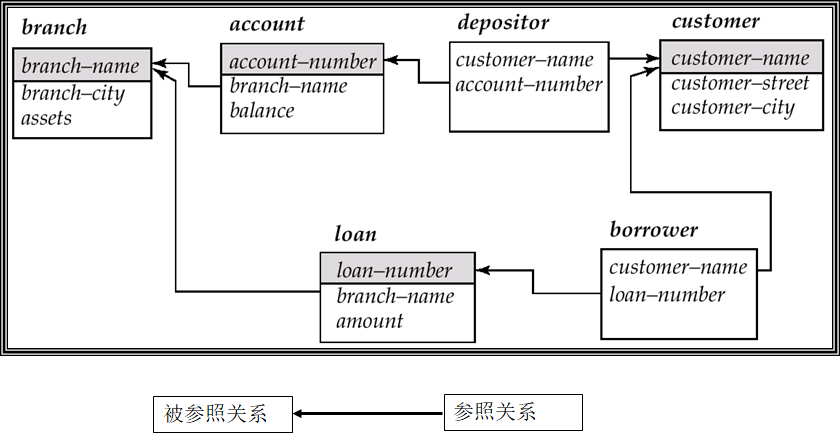

#### 2.1.10 Query Languages

- Language in which user requests information from the database
- 查询语言可以分为**过程化语言(procedural language)**和**非过程化语言(nonprocedural language)**，在过程化语言中， 用户指导系统对数据库执行一系列操作以计算出所需结果;在非过程化语言中， 用户只需描述所需信息， 而不用给出获取该信息的具体过程
- Pure languages
  - 关系代数(Relational Algebra)是过程化的
  - 元组关系演算(Tuple Relational Calculus)是非过程化的
  - 域关系演算(Domain Relational Calculus)是非过程化的12
- Pure languages form underlying basis of query languages that people use

### 2.2 Fundamental Relational-Algebra Operations

#### 2.2.1 Basic operators

- Select(选择)
- Project(投影)
- Union(并)
- set difference(差/集合差)
- Cartesian product(笛卡儿积)
- Rename(改名/重命名)
-  The operators take one or two relations as inputs, and return a new relation as a result

#### 2.2.2 Select Operation Formalization

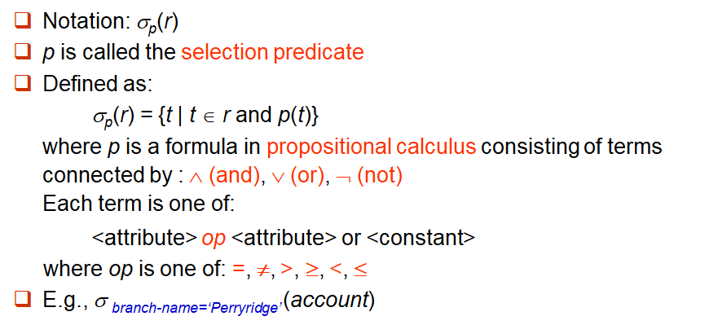

#### 2.2.3 Project Operation Formalization

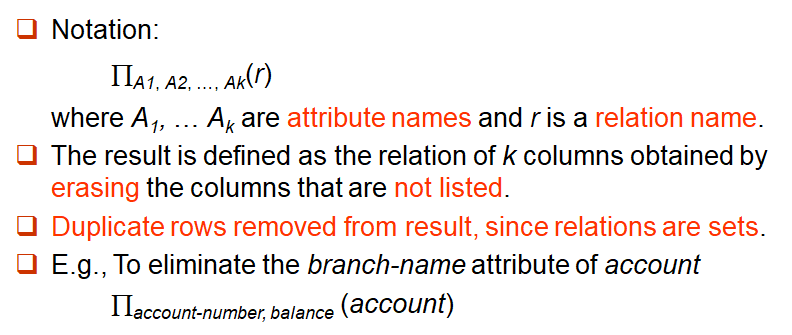

#### 2.2.4 Union Operation Formalization

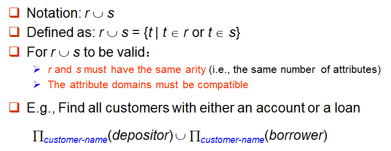

- *r*和*s*可以是数据库关系或者作为关系代数表达式结果的临时关系

#### 2.2.5 Set Difference Operation Formalization

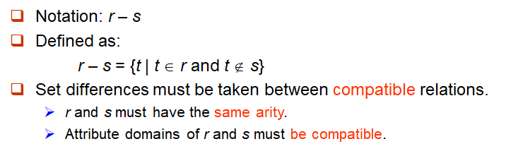

#### 2.2.6 Cartesian-Product Operation Formalization

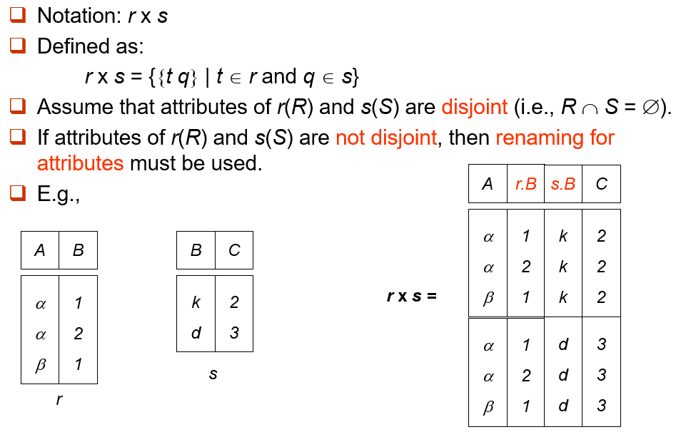

#### 2.2.7 Composition of Operations

- Can build **relational-algebra expressions** using **multiple operations**

#### 2.2.8 Rename Operation

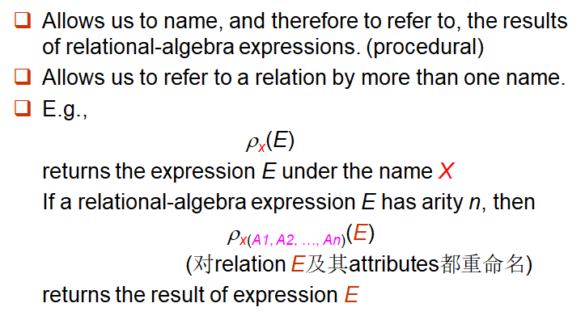

### 2.3 Additional Relational-Algebra Operations

#### 2.3.1 Basic operators

- Set intersection(交) 
- Natural join(自然连接)
- Division(除) 
- Assignment(赋值)
- We define additional operations that do not add any power to the relational algebra, but that simplify common queries

#### 2.3.2 Set-Intersection Operation Formalization

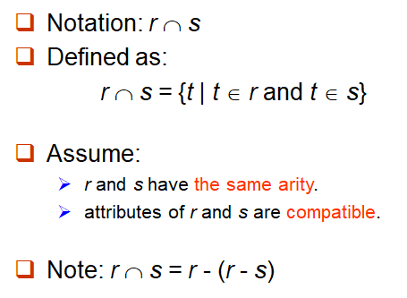

#### 2.3.3 Natural Join Operation Formalization

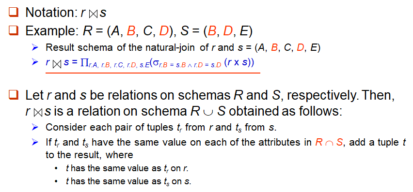

> Note:
>
> - *r*, *s*必须含有共同属性(名和域都对应相同)
> - 连接二个关系中同名属性值相等的元组
> - 结果属性是二者属性集的并集, 但消去重名属性

- 自然连接是**可结合的(associative)**

#### 2.3.4 Theta Join Operation Formalization

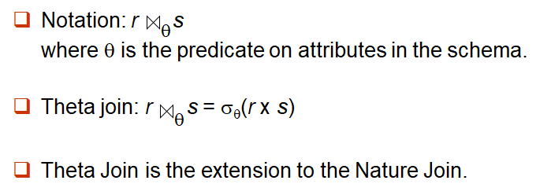

#### 2.3.5 Division Operation Formalization

- Suited to queries that include the phrase “**for all**”
- In fact, it determines whether a collection contains another collection

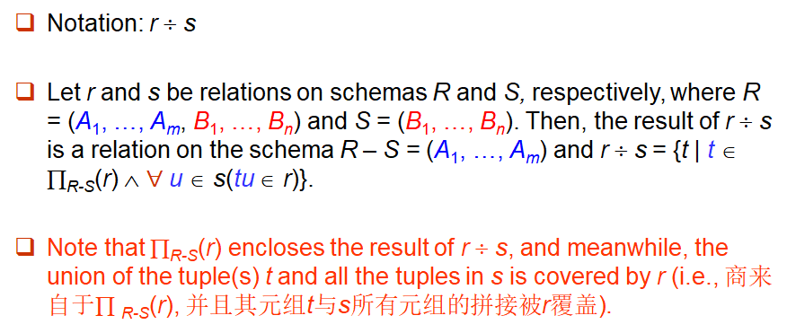

#### 2.3.6 Division Operation Characteristic

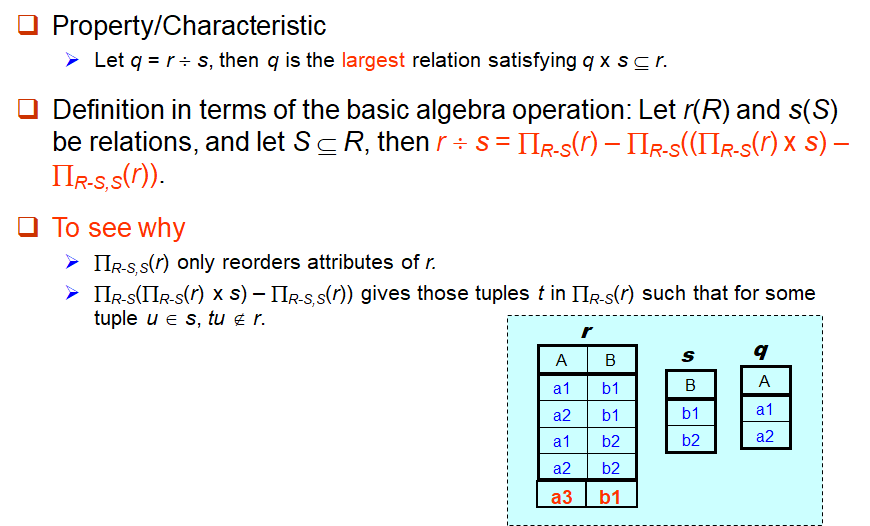

#### 2.3.7 Assignment Operation

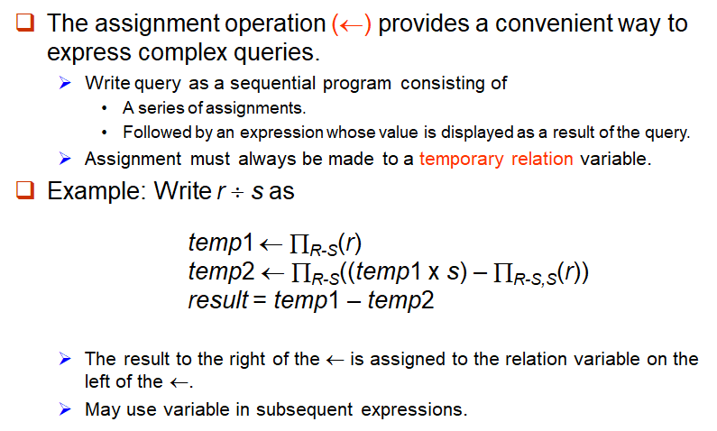

#### 2.3.8 Summary

- Union, Set difference, Set intersection为双目、等元运算
- Cartesian product, Natural join, Division为双目运算
- Project, Selec为单运算对象
- The priority of operations is as follows
  - Project
  - Select
  - Cartesian Product (times)
  - Join, division
  - Intersection
  - Union, difference

### 2.4 Extended Relational-Algebra Operations

#### 2.4.1 Generalized Projection(广义投影)

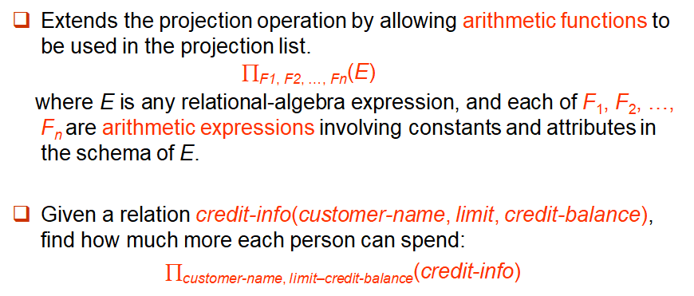

#### 2.4.2 Aggregate Functions and Operations

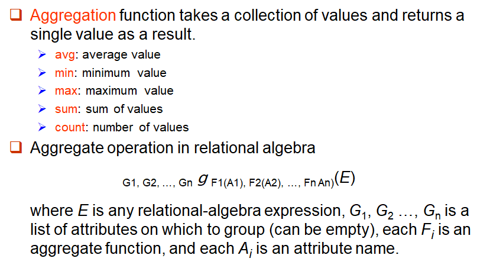

- 聚合函数输入的汇集中一个值可以出现多次，值出现的顺序无关紧要，这样的汇集称为多重集

- Result of aggregation does not have a name
  - Can use rename operation to give it a name
  - For convenience, we permit renaming as part of aggregate operation

### 2.5 Modification of the Database

#### 2.5.1 Basic operations

- Deletion
- Insertion
- Updating
- All these operations are expressed using the assignment operator

#### 2.5.2 Deletion

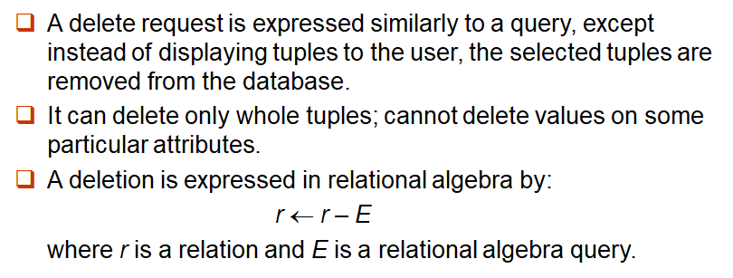

#### 2.5.3 Insertion

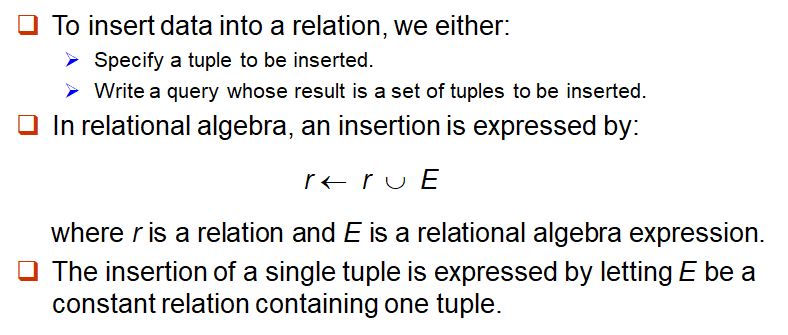

#### 2.5.4 Update

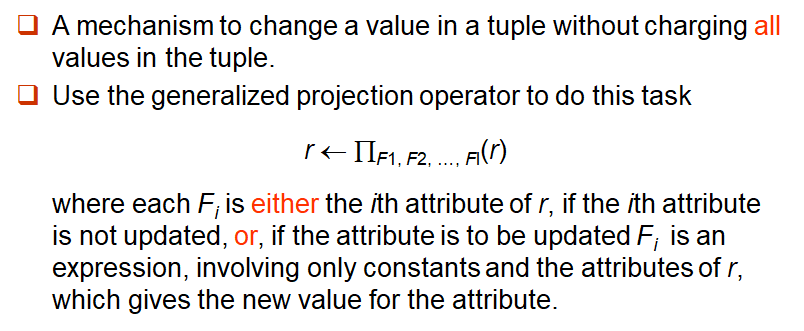

