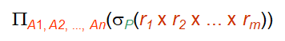

# WEEK 3

## 3 SQL

### 3.1 Introduction to SQL

- Structured Query Language (SQL, 结构化查询语言)
- SQL includes several parts: 
  - 数据定义语言(Data-Definition Language, DDL)  
  - 数据操纵语言(Data-Manipula

### 3.2 Data Definition Language

- The main functions of DDL contain:
  - Define the **schema** for each relation 
  - Define the **domain** of values associated with each attribute
  - Define the **integrity constraints(完整性约束)**
  - Define the **physical storage** structure of each relation on disk
  - Define the **indices** to be maintained for each relations
  - Define the **view** on relations

#### 3.2.1 Domain Types in SQL

- **char($n$)**: Fixed length character string, with user-specified length
- **varchar($n$)**: Variable length character strings, with user-specified maximum length $n$
- **int**: Integer (a finite subset of the integers that is machine-dependent)
- **smallint**: Small integer (a machine-dependent subset of the integer domain type)
- **numeric($p, d$)**: Fixed point number, with user-specified precision of $p$ digits(including sign), with $d$ digits to the right of decimal point
- **real, double precision**: Floating point and double-precision floating point numbers, with machine-dependent precision
- **float($n$)**: Floating point number, with user-specified precision of at least $n$ digits
- **Null values** are allowed in all the domain types. Declaring an attribute to be not null prohibits null values for that attribute
- **date**: Dates, containing a (4 digits) year, month and date
- **Time**: Time of day, in hours, minutes and seconds
- **timestamp**: date plus time of day
- SQL中有许多函数用于处理各种类型的数据及其类型转换，但各数据库系统中函数的标准化程度不高

#### 3.2.2 Create Table


#### 3.2.3 Integrity Constraints in Create Table

- not null
- primary key($A_1,\cdots,A_n$)
- foreign key($A_1,\cdots,A_n$) references
- check($P$), where $P$ is a predicate
- Primary key declaration on an attribute automatically ensures not null in SQL_92 onwards, needs to be explicitly stated in SQL_89


#### 3.2.4 Drop and Alter Table

- The drop table command deletes all information about the dropped relation from the database

  ```sql
  DROP TABLE r
  ```

- The alter table command is used to add attributes to an existing relation

  ```sql
  ALTER TABLE r ADD A D; 
  ALTER TABLE r ADD (A1D1, …, AnDn); 
  ```

  where *A* is the name of the attribute to be added to relation *r*, and *D* is the domain of *A*

- The alter table command can also be used to drop attributes of a relation

  ```sql
  ALTER TABLE r DROP A 
  ```

  where *A* is the name of an attribute in relation *r* 

- Note that dropping of attributes is not supported by many databases

- The alter table command can also be used to modify the attributes of a relation

  ```sql
  ALTER TABLE branch MODIFY (branch_name char(30), assets not null); 
  ```

#### 3.2.5 Create Index

```sql
CREATE INDEX <i-name> ON <table-name> (<attribute-list>); 
CREATE UNIQUE INDEX <i-name> ON <table-name> (<attribute-list>); /*specify a candidate key*/
DROP INDEX <i-name> /*drop an index*/
```

### 3.3 Basic Structure

#### 3.3.1 The select clause 

- A typical SQL query has the form: 

  ```sql
  SELECT A1, A2, ..., An 
  FROM r1, r2, ..., rm
  WHERE P 
  ```

  where $A_i$: attributes, $r_i$: relations, and $P$: predicate

- This query is equivalent to the relational algebra expression below

  

- The result of an SQL query is a relation

> Note:
>
> - SQL does not permit the ‘**-**’ character in names, and thus use *branch***_***name* instead of *branch***-***name* in the real implementation
> - SQL names are **case insensitive**(不区分大小写)

- SQL **allows duplicates** in relations as well as in query results
- To force the elimination of duplicates, insert the keyword **distinct**  after select, and the opposite keyword **all** allow duplicates
- By default, duplicates are allowed, that is, all is the default
- An asterisk ***** in the select clause denotes **all attributes**
- However, the select clause can contain **arithmetic expressions** involving the operations **+**, **-**, ***** and **/** as well as operating on constants or attributes of tuples

#### 3.3.2 The where clause

- The **WHERE** clause specifies conditions that the result must satisfy


- In **WHERE** clause, comparison results can be combined using the logical connectives including **AND**, **OR**, and **NOT**, as well as a **BETWEEN** comparison operator can be used for specifying a range

#### 3.3.3 The from clause 

- The **FROM** clause lists the relations involved in the query
  - Corresponds to the Cartesian product operation of the relational algebra, if more than one relation is specified in the FROM clause


#### 3.3.4 The rename operation

- The SQL allows renaming relations and attributes using the **as** clause

  ```sql
  old_name as new_name 
  ```

- **as** is optional

  - SQL Server allows *new-name* = *column expression*

- **Tuple variables** are defined in the FROM clause via the use of the **as clause**

  

  

- 被用来重命名关系的标识符在SQL标准中被称作**相关名称(correlation name)**，但通常也被称作**表别名(table alias)**，或者**相关变量(correlation variable)**，或者**元组变量(tuple variable)**

#### 3.3.5 String operations 

- SQL includes a **string-matching operator** for comparisons on character strings. Patterns are described using the following two special characters: 
  - **%** matches **any substring** (likes * in the file system)
  - **_** matches **any character** (like ? in the file system)

> Note: Fuzzy matching can be achieved (place the **WHERE** clause, and must be used in conjunction with the **LIKE** operation). 

- 在**like**比较运算中使用**escape**关键词来定义转义字符

  ```sql
  like 'ab\%cd%' escape '\' /*匹配所有以"ab%cd"开头的字符串*/
  ```

- SQL 允许使用**not like**比较运算符搜寻不匹配项

- SQL supports a variety of string operations

  - Concatenation (using “**||**” )
  - Converting from upper to lower case (and vice versa) using Functions **lower( )** and **upper ( )**
  - Finding string length
  - Extracting substrings

#### 3.3.6 Ordering the display of tuples 


- We may specify **desc** for **descending order** or **asc** for **ascending order**, and for each attribute, ascending order is the default

  ```sql
  SELECT *
  FROM instructor
  ORDER BY salary DESC, name ASC;
  ```

#### 3.3.7 Duplicates


### 3.4 Set Operations

- In SQL, use the set operations including **UNION**, **INTERSECT**, and **EXCEPT** operate on relations as well as correspond to the relational algebra operations $\cup$, $\cap$, and $-$
- Each of the operations including UNION, INTERSECT, and EXCEPT automatically **eliminates duplicates**
- To **retain all duplicates**, we can use the corresponding multiset versions including **UNION ALL**, **INTERSECT ALL**, and **EXCEPT ALL**
- Suppose a tuple occurs *m* times in *r* and *n* times in *s,* then, it occurs:
  - *m + n* times in (*r* UNION ALL *s*)
  - min(*m*, *n*) times in (*r* INTERSECT ALL *s*)
  - max(0, *m* *–* *n*) times in (*r* EXCEPT ALL *s*) 

> Note: 
>
> - Oracle uses UNION, UNION ALL, INTERSECT, and MINUS instead of EXCEPT; but no INTERSECT ALL and MINUS ALL. 
> - SQL Server 2000 only supports UNION and UNION ALL. 

### 3.5 Aggregate Functions

- These functions (see below) operate on the multiset values of a relation’s column, and return a value
  - **avg(col)**: average value
  - **min(col)**: minimum value 
  - **max(col)**: maximum value 
  - **sum(col)**: sum of values 
  - **count(col)**: number of values
- SQL 不允许在用**count(col)**时使用**distinct**
- **group by** 子句中给出的的一个或多个属性是用来构造分组的，子句中的所有属性取值相同的元组将被分在一个组中

- 任何没有出现在**group by**子句中的属性如果出现在**select**子句中，则只能出现在聚集函数内部，否则这样的查询是错误的，例如：

  ```sql
  /*错误查询*/
  SELECT dept_name, ID, avg(salary)
  FROM instructor
  GROUP BY dept_name;
  ```

- **having**子句中的谓词在形成分组后才起作用，条件针对**group by**子句构成的分组


- The execution order of SELECT: From → where → group (aggregate) → having → select → distinct → order by

> Note: **Predicates** in the **having** clause are applied **after** the formation of **groups,** whereas predicates in the **where** clause are applied **before** forming **groups**.

- Aggregate functions cannot be used in where clause directly