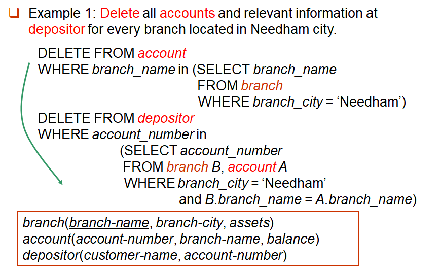
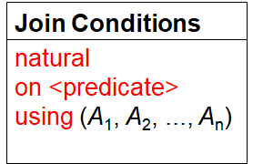

# WEEK 4

### 3.6 Null Values

- **Null** is a special marker used in SQL, and was first introduced by E.F. Codd

- The meaning is "**missing** information" or "**inapplicable** information", i.e., **unknown value** or that a value **does not exist**. 

- **The result of any arithmetic expression involving ‘*null*’ is null**

- Any comparison with *null* returns "**unknown**" 

- Three-valued logic using the truth value *unknown*: (**true, unknown,  false**) 

  - OR: 

    (*unknown* or *true*) = *true* 

    (*unknown* or *false*) = *unknown* 

    (*unknown* or *unknown*) *= unknown*

  - AND: 

    (*true* and *unknown*) *= unknown*

    (*false* and *unknown*) *= false*

    (*unknown* and *unknown*) *= unknown* 

  - NOT: 

    (not *unknown*) *= unknown* 

- Result of **where** clause predicate is treated as **false** if it evaluates to **unknown**

- The predicate **is null**, **is not null** can be used to check for null values

- “P **is unknown**” evaluates to true if predicate *P* evaluates to **unknown**

- **Aggregate functions simply ignore nulls**

- All aggregate operations **except count(*)** ignore tuples with null values on the aggregated attributes

### 3.7 Nested Subqueries

- SQL provides a mechanism for the nesting of subqueries
- A subquery is a **select_from_where** expression that is nested within another query
- A common use of subqueries is to perform tests for **set membership**, **set comparisons**

#### 3.7.1 Set Comparison


- Definition of **Some** Clause

  

- Definition of **All** clause

  

#### 3.7.2 Test for Empty Relations

- The **exists** construct returns the value true if the argument subquery is non-empty
- **exists** $r\lrarr r\neq \empty$
- **not exists** $r\lrarr r=\empty$

#### 3.7.3 Test for Absence of Duplicate Tuples

- The **unique** construct tests whether a subquery has any duplicate tuples in its result


### 3.8 Views

- Provide a mechanism to **hide certain data** from the view of certain users

- To create a view we use the command: 

  ```sql
  CREATE VIEW <v_name> AS 
  	SELECT c1, c2, … From … 
  CREATE VIEW <v_name> (c1, c2, …) AS 
  	SELECT e1, e2, … FROM … 
  ```

- Benefits of using views

  - Security
  - Easy to use, support logical independent

- To drop view:

  ```sql
  DROP VIEW <V_NAME> 
  ```


### 3.9 Derived Relations


- The WITH clause allows views to be defined **locally** for a query, **rather than globally**


### 3.10 Modification of the Database

#### 3.10.1 Deletion

- Formal form:

  ```sql
  DELETE FROM <table | view> 
  [WHERE <condition>] 
  ```

  

- **Problem**: as we delete tuples from account, the average balance changes

- Solution actually used in SQL

  - Compute avg balance and find all tuples to delete
  - Delete all tuples found above (without recomputing avg or retesting the tuples) 
  - 在同一SQL语句内，除非外层查询的元组变量引入内层查询，否则层查询只进行一次

#### 3.10.2 Insertion

- Format:

  ```sql
  INSERT INTO <table|view> [(c1, c2,…)] 
  VALUES (e1, e2, …) 
  
  INSERT INTO <table|view> [(c1, c2,…)] 
  SELECT e1, e2, … 
  FROM …
  ```

  

- The “**select from where**” statement is fully evaluated **before** any of its results are inserted into the relation, thus the statement below is right:

  ```sql
  INSERT INTO table1 
  SELECT * 
  FROM table1
  ```

#### 3.10.3 Updates

- Format of update statement: 

  ```sql
  UPDATE <table | view> 
  SET <c1 = e1 [, c2 = e2, …]> [WHERE <condition>]
  ```
  
  

- The order is important

- Can be done better using the case statement

  

- Update of a view

  

  - 建立在单个基本表上的视图，且视图的列对应表的列，称为“行列视图”
  - Updates on more complex views are difficult or impossible to translate, and hence are disallowed
  - View 是虚表，对其进行的所有操作都将转化为对基表的操作
  - 查询操作时，VIEW与基表没有区别，但对VIEW的更新操作有严格限制，如只有行列视图，可更新数据
  - Most SQL implementations allow updates only on simple views defined on a single relation and without aggregates 

#### 3.10.4 Transactions

- A transaction is a sequence of queries and data update statements executed as a single logical unit
- Transactions are started implicitly and terminated by one of:
  - **COMMIT WORK**: makes all updates of the transaction permanent in the database
  - **ROLLBACK WORK**: undoes all updates performed by the transaction
- If any step of a transaction fails, all work done by the transaction can be undone by **rollback work**
- Rollback of incomplete transactions is done automatically, in case of system failures
- The four properties of transaction are required: **atomicity, isolation,  consistency, durability**
- In some database systems, each SQL statement that executes successfully is automatically committed
  - Each transaction would then consist of only a single statement
  - Automatic commit can usually be turned off, allowing multi_statement transactions, but how to do so depends on the database system

### 3.11 Joined Relations

- Join operations take as input two relations and return as a result another relation

- **Join condition** – defines **which tuples** in the two relations **match**, and what attributes are present in the result of the join

  

- **Join type** – defines how tuples in each relation that **do not match any tuple** in the other relation (based on the join condition) are treated

  