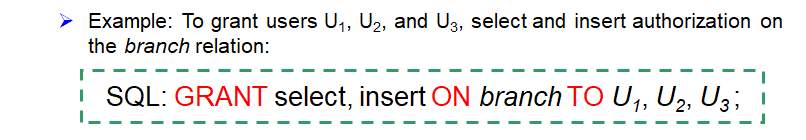

# WEEK 5

## 4 Advanced SQL

### 4.1 SQL Data Types and Schemas

- Built-in data types in SQL

- User-defined types

  - Structured data types

  - Distinct types 

    ```sql
    create type person_name as varchar(20) 
    create table student 
    				(sno char(10) primary key, 
                     sname person_name, 
                     ssex char(1), 
                     birthday date) 
    drop type person_name 
    ```

- Create new domain

  ```sql
  create domain Dollars as numeric(12, 2) not null; 
  create domain Pounds as numeric(12, 2); 
  create table employee 
  				(eno char(10) primary key, 
                   ename varchar(15), 
                   job varchar(10), 
                   salary Dollars, 
                   comm Pounds);
  ```

- Large-object types

  - Large objects (e.g., photos, videos, CAD files, etc.) are stored as a large object:

    - **blob**: binary large object -- object is a large collection of uninterpreted binary data (whose interpretation is left to an application outside of the database system) 
    - **clob**: character large object -- object is a large collection of character data 

    ```sql
    create table students
    				(sid char(10) primary key,
                     name varchar(10),
                     gender char(1),
                     photo blob(20MB),
                     cv clob(10KB));
    ```

  - When a query returns a large object, a **pointer** is returned rather than the large object itself

- Catalogs, schemas and environments

  

### 4.2 Integrity Constraints

- Integrity constraints guard against accidental damage to the database, by ensuring that authorized changes to the database do not result in a loss of data consistency
- 实体完整性、参照完整性和用户定义的完整性约束 
- 完整性约束是数据库实例(Instance)必须遵循的 
- 完整性约束由DBMS维护

#### 4.2.1 Constraints on a single relation

- not null
- primary key
- unique
- check(*P*), where *P* is a predicate

```sql
create table branch2
				(branch_name varchar(30) primary key,
                 branch_city varchar(30),
                 assets integer not null,
                 check (assets >= 100));
```

#### 4.2.2 Domain Constraints

- The **check** clause in SQL-92 permits **domains to be restricted**

  ```sql
  create domain hourly-wage numeric(5, 2) 
  constraint value-test check(value > = 4.00) 
  ```

- The clause **constraint *value-test*** is optional; useful to indicate which constraint an update violated

#### 4.2.3 Referential Integrity

- Formal Definition:

  - Let $r_1(R_1)$ and $r_2(R_2)$ be the relations with primary keys $K_1$ and $K_2$, respectively

  - The subset $\alpha$ of $R_2$ is a **foreign key** referencing $K_1$ in relation $r_1$, if for every $t_2$ in $r_2$ there must be a tuple $t_1$ in $r_1$ such that $t_1[K_1] = t_2[\alpha]$

  - Referential integrity constraint also called **subset dependency**, since its can be written as
    $$
    \Pi_\alpha(r_2)\sube\Pi_{K_1}(r_1)
    $$

- Assume there exists relations *r* and *s*: *r*(*A, B, C*), *s*(*B, D*), we say attribute *B* in *r* is a **foreign key** from relation *r*, and *r* is called **referencing relation(参照关系)**, and *s* is called **referenced relation(被参照关系)**
- 参照关系中外码的值必须在被参照关系中实际存在，或为null

##### Checking Referential Integrity on Database Modification

- The following tests must be made in order to preserve the following **referential integrity constraint**:
  $$
  \Pi_\alpha(r_2)\sube\Pi_K(r_1)
  $$
  $\alpha$ in $r_2$ is a foreign key

- **Insert**: If a tuple $t_2$ is inserted into $r_2$, the system must ensure that there is a tuple $t_1$ in $r_1$ such that $t_1[K] = t_2[\alpha]$, i.e., $t_2[\alpha]\in\Pi_K(r_1)$

- **Delete**: If a tuple $t_1$ is deleted from $r_1$, the system must compute the set of tuples in $r_2$ that reference $t_1$: $\sigma_\alpha=_{t_1[K]}(r_2)$(如果$r_2$中存在与$r_1$中被删记录匹配的元组). If this set is **not empty**, then **either the delete command is rejected** as an error, **or** the tuples in $t_2$ that references $t_1$ **must themselves be deleted**(**cascading deletions are possible**)

- **Update**: If a **tuple** $t_2$ is updated in **relation** $r_2$ and the update modifies values for foreign key $\alpha$, then a test similar to the insert case is made:

  - Let's $t_2'$ denote the new value of tuple $t_2$. The system must ensure that $t_2'[\alpha]\in\Pi_K(r_1)$

##### Referential Integrity in SQL

- Primary, candidate keys, and foreign keys can be specified as part of the SQL create table statement
  - The **primary key** clause lists attributes that comprise the primary key
  - The **unique key** clause lists attributes that comprise a **candidate key**
  - The **foreign key** clause lists the attributes that comprise the foreign key, and the name of the relation referenced by the foreign key
  
- **By default**, a foreign key references **the primary key attributes of the referenced table**:

  ```sql
  foreign key (account-number) references account
  ```

- **Short form** for specifying a single column as foreign key:

  ```sql
  account-number char(10) references account
  ```

- Reference columns in the referenced table can be explicitly specified but must be declared as primary/candidate keys: 

  ```sql
  foreign key (account-number) references account (account-number)
  ```

  > *account-number* 名字可以不同

##### Cascading Actions in SQL

```sql
create table account( 
		...
	foreign key (branch-name) references branch 
		[on delete cascade]
		[on update cascade]
		...); 
```

- Due to the on delete cascade clauses, if a delete of a tuple **in *branch*** results in referential-integrity constraint violation, the delete “cascades” to the *account* relation, deleting the tuple in *account* that refers to the *branch* which was deleted
- Cascading updates are similar
- If there is a chain of foreign-key dependencies across multiple relations, with on delete cascade specified for each dependency, **a deletion or update at one end of the chain can propagate across the entire chain**
- But, if a **cascading update** or delete causes a constraint violation that cannot be handled by a further cascading operation, the system **aborts the transaction**
  - As a result, **all the changes** caused by the transaction and its cascading actions are **undone**
- Alternative to cascading:
  - on delete set null
  - on delete set default
- Null values in foreign key attributes complicate SQL referential integrity semantics, and are best prevented using not null
  - if any attribute of a foreign key is null, the tuple is defined to satisfy the foreign key constraint

> Note: Referential integrity is only checked at the end of a transaction. Intermediate steps are allowed to violate referential integrity provided later steps remove the violation by the end of the transaction. Otherwise, it would be impossible to create some database states, e.g., insert two tuples whose foreign keys point to each other

#### 4.2.4 Assertions

- An **assertion** is a predicate expressing a condition that we wish the database always to satisfy. --- **for complex check condition** on several relations

- An assertion in SQL takes the form:

  ```sql
  CREATE ASSERTION <assertion-name> 
  CHECK <predicate>; 
  ```

- When an assertion is made, the system tests it for validity **on every update** that may violate the assertion. (when the **predicate** is true, it is Ok, otherwise report error.)

  - **This testing may introduce a significant amount of overhead**; hence assertions should be used with great care


#### 4.2.5 Triggers

- A trigger is a statement that is executed **automatically** by the system **as a side-effect of a modification** to the database
- To design a trigger mechanism, we must:
  - Specify the **conditions** under which the trigger is to be executed
  - Specify the **actions** to be taken when the trigger executes
- Triggers were introduced to SQL standard in SQL:1999, but supported even earlier using non-standard syntax by most databases
- A kind of stored procedures


### 4.3 Authorization

- Security - protection from malicious attempts to **steal** or **modify** data
  - Database system level
    - Authentication and authorization mechanisms allow specific users access only to required data
    - We concentrate on authorization in the rest of this chapter
  - Operating system level
    - Operating system super-users can do anything they want to the database!   Good operating system level security is required
  - Network level:  must use encryption to prevent
    - Eavesdropping (unauthorized reading of messages)
    - Masquerading (pretending to be an authorized user or sending messages supposedly from authorized users)
  - Physical level
    - Physical access to computers allows destruction of data by intruders;  traditional lock-and-key security is needed
    - Computers must also be protected from floods, fire, etc. -- (Recovery)
  - Human level
    - Users must be screened to ensure that an authorized users do not give access to intruders
    - Users should be trained on password selection and secrecy
- Forms of authorization on parts of  the database:
  - **Read authorization** - allows reading, but not modification of data
  - **Insert authorization** - allows insertion of new data, but not modification of existing data
  - **Update authorization** - allows modification, but not deletion of data
  - **Delete authorization** - allows deletion of data
- Forms of authorization to modify the database schema:
  - **Index authorization** - allows creation and deletion of indices
  - **Resources authorization** - allows creation of new relations
  - **Alteration authorization** - allows addition or modifying of attributes in a relation
  - **Drop authorization** - allows deletion of relations

#### 4.3.1 Authorization and Views

- Users can be given **authorization on views**, without being given any authorization on the relations used in the view definition
- Ability of **views** to **hide data** serves both to **simplify usage** of the system and to **enhance security** by allowing users access only to data they need for their job
- A **combination of relational-level security and view-level security** can be used to limit a user’s access to precisely  the data that user needs

#### 4.3.2 Authorization on Views

- Creation of view does not require resources authorization since no real relation is being created
- The creator of a view gets only those privileges that provide no additional authorization beyond that he already had

#### 4.3.3 Granting of Privilege


#### 4.3.4 Authorization Grant Graph

- **Requirement**: All edges in an authorization graph must **be part of some path originating with the database administrator**
- If DBA revokes grant from $U_1$:
  - Grant must be revoked from $U_4$ since $U_1$ no longer has authorization
  - Grant must not be revoked from $U_5$, since $U_5$ has another authorization path from DBA through $U_2$
- Must prevent cycles of grants with no path from the root:
  - DBA grants authorization to $U_7$
  - $U_7$ grants authorization to $U_8$
  - $U_8$ grants authorization to $U_7$
  - DBA revokes authorization from $U_7$
- Must revoke grant $U_7$ to $U_8$ and from $U_8$ to $U_7$, since there is no path from DBA to $U_7$ or to $U_8$ anymore

#### 4.3.5 Security Specification in SQL

- The grant statement is used to confer authorization

  ```sql
  GRANT <privilege list> ON <table|view> 
  TO <user list> 
  ```

- \<user list\> is:

  - user-ids
  - public, which allows all valid users the privilege granted
  - A role (more details about this later)

- Granting a privilege on a view does not imply granting any privileges on the underlying relations

- The grantor of the privilege must already hold the privilege on the specified item (or be the database administrator)

#### 4.3.6 Privileges in SQL

- **Select**: allows read access to relation, or the ability to query using the view

  

- **Insert**: the ability to insert tuples

- **Update**: the ability to update using the SQL update statement

- **Delete**: the ability to delete tuples

- **References**: ability to declare foreign keys when creating relations

- **All privileges**: used as a short form for all the allowable privileges

- **All**

- **With grant option**: Allows a user who is granted a privilege to pass the privilege on to other users

  

#### 4.3.7 Roles

- Roles permiting **common privileges** for a class of users can be specified just once, by creating a corresponding “**role**”
- Privileges can be granted to or revoked from roles, just like user; roles can be assigned to users, and even to other roles


#### 4.3.8 Revoking Authorization in SQL

- The revoke statement is used to revoke authorization

  ```sql
  REVOKE <privilege list> ON <table|view> 
  FROM <user list> [restrict|cascade] 
  ```

- Revocation of a privilege from a user may cause other users also to lose that privilege, which is referred to as **cascading of the revoke**

- We can **prevent cascading** by specifying restrict: 

  ```sql
  Revoke select on branch from U1, U3 restrict; 
  ```

  With restrict, the revoke command fails if cascading revokes are required

- \<privilege-list> may be **ALL**, to revoke all privileges the revokee may hold

- If \<revokee-list> includes **PUBLIC**, all users lose the privilege except those granted it explicitly

- If the same privilege was granted twice to the same user by different grantees, the user may retain the privilege after the revocation

- All privileges that depend on the privilege being revoked are also revoked

#### 4.3.9 Limitations of SQL Authorization

- SQL does not support authorization at a tuple level
- With the growth in Web access to databases, database accesses come primarily from application servers
  - End users don't have database user ids, they are all mapped to the same database user id
- All end-users of an application (such as a web application) may be mapped to a single database user
- The task of authorization in above cases falls on the application program, with no support from SQL
  - **Benefit**: Fine grained authorizations, such as to individual tuples, can be implemented by the application
  - **Drawback**: Authorization must be done in application code, and may be dispersed all over an application
  - **Checking for absence of authorization loopholes** becomes **very difficult** since it requires reading large amounts of application code

#### 4.3.10 Audit Trails 

- An audit trail is **a log of all changes** (inserts/deletes/updates) to the database along with information such as **which user** performed the change, and **when** the change was performed
- Used to **track erroneous/fraudulent updates**
- Can be implemented using triggers, but **many database systems provide direct support**

### 4.4 Embedded SQL

- SQL的功能不完备性。（计算，资源…） 

- The SQL standard defines embeddings of SQL in a variety of programming languages such as Pascal, PL/I, Fortran, C, and Cobol

- A language in which SQL queries are embedded is referred to as a **Host language(宿主语言)**, and the SQL structures permitted in the host language comprise embedded SQL

- **EXEC SQL** statement is used to identify embedded SQL request to the preprocessor:

  ```
  EXEC SQL <embedded SQL statement> END_EXEC
  ```

  > Note: This varies by language.

#### 4.4.1 Query

- 


### 4.5 Dynamic SQL

- Allows programs to construct and submit SQL queries at run time


- The dynamic SQL program contains a **?**, which is a place holder(占位符) for a value that is provided by **‘using’ variable** when the SQL program is executed

### 4.6 ODBC and JDBC

#### 4.6.1 ODBC

- Open DataBase Connectivity(ODBC, 开放数据库互连) 
  - A standard for application program to communicate with a database server
  - By application program interface (API) to
    - Open a connection with a database
    - Send queries and updates
    - Get back results
- Applications such as GUI, spreadsheets, etc. can use ODBC
- Embedded SQL vs. ODBC
  - Embedded SQL: The pre_compiler is DBMS_specific
  - ODBC provides a standardized way for connection of database to the application programmers through API
    - Not DBMS_specific
    - Need not precompiling
- ODBC提供了一个公共的、与具体数据库无关的应用程序设计接口API 。它为开发者提供单一的编程接口，这样同一个应用程序就可以访问不同的数据库服务器
- 使用ODBC访问数据库的方法：
  - ODBC API访问数据库
  - Visual C++的MFC提供了丰富的ODBC类，它们封装了大量的函数用以完成数据库的大部分应用
- 访问数据库的其他方法：
  - OLE DB (Object Link and Embedding DataBase) --- 是一套通过COM (Component Object Model,组件对象模型)接口访问数据库的ActiveX的底层接口技术,速度快，支持关系型和非关系型数据库，编程量大
  - ADO---基于COM，建立在OLE DB 之上，更易于使用
  - DAO(Data Access Objects) 


- 首先要定义ODBC数据源：控制面板 -> 管理工具 -> 数据源(ODBC) -> DSN (data source name) 

- ODBC编程要点

  - ODBC接口定义了三种句柄类型

    

  

  

  

  

  

  

  

- ODBC编程基本流程

  

- ODBC program first allocates an SQL environment, then a database connection **handle**
- Opens database connection using SQLConnect().Parameters for SQLConnect are as follows:
  - Connection handle
  - The server to which to connect
  - The user identifier
  - Password
- Must also specify types of arguments:
  - SQL_NTS denotes previous argument is a null_terminated string

```c
int ODBCexample()   // 程序结构
{
    RETCODE error; 
	HENV env;   /* environment */ 
	HDBC conn;   /* database connection */ 
	SQLAllocEnv(&env); 
	SQLAllocConnect(env, &conn);   /* 建立连接句柄 */ 
	SQLConnect (conn, “MySQLServer”, SQL_NTS, “user”, SQL_NTS, “password”, SQL_NTS);  
    /* 建立用户user与数据源的连接，SQL_NTS表示前一参量以null结尾 */ 
	
    //Main body of program
    char branchname[80]; 
	float balance; 
	int lenOut1, lenOut2; 
	HSTMT stmt; 
	SQLAllocStmt(conn, &stmt);   /* 为该连接建立数据区，将来存放查询结果 */ 
	char * sqlquery = “select branch_name, sum (balance) from account 
    		           group by branch_name”;   /* 装配SQL语句 */ 
	error = SQLExecDirect(stmt, sqlquery, SQL_NTS); 
    /* 执行sql语句,查询结果存放到数据区stmt，同时sql语句执行状态的返回值送变量error*/
    if (error == SQL_SUCCESS) 
    {
        SQLBindCol(stmt, 1, SQL_C_CHAR, branchname,80, &lenOut1); 
	    SQLBindCol(stmt, 2, SQL_C_FLOAT, &balance, 0, &lenOut2); 
	    /* 对stmt中的返回结果数据加以分离，并与相应变量绑定。第1项数据转换为C的字符类型，送变量branchname(最大长度80)，lenOut1为实际字符串长度（若＝-1代表null），第2项数据转换为C的浮点类型送变量balance中 */ 
	    while ( SQLFetch(stmt) >= SQL_SUCCESS)  /* 逐行从数据区stmt中取数据，放到绑定变量中 */ 
        { 
	  		printf (" %s  %d\n", branchname, balance); 
            /*对取出的数据进行处理*/ 
        }
    }
    SQLFreeStmt(stmt, SQL_DROP);  /*释放数据区*/ 
    
	SQLDisconnect(conn); 
	SQLFreeConnect(conn); 
	SQLFreeEnv(env); 
}
```

- Program sends SQL commands to the database by using SQLExecDirect
- Result tuples are fetched using SQLFetch()
- SQLBindCol() binds C language variables to attributes of the query result
- Good programming requires checking results of every function call for errors; we have omitted most checks for brevity

- ODBC Conformance Levels
  - ODBC Conformance levels specify subsets of the functionality defined by the standard. (不同版本ODBC提供不同等级的标准)
    - Core level
    - Level 1 requires support for metadata querying
    - Level 2 requires ability to send and retrieve arrays of parameter values and more detailed catalog information
  - SQL Call Level Interface (CLI) standard similar to ODBC interface, but with some minor differences

#### 4.6.2 JDBC

- JDBC is a Java API for communicating with database systems supporting SQL
- JDBC supports a variety of features for querying and updating data, and for retrieving query results
- JDBC also supports metadata retrieval, such as querying about relations present in the database and the names and types of relation attributes
- Model for communicating with the database:
  - Open a connection
  - Create a “statement” object
  - Execute queries using the Statement object to send queries and fetch results
  - Exception mechanism to handle errors