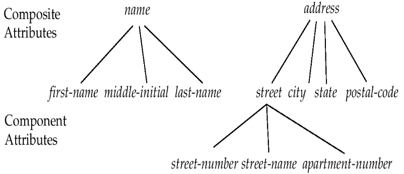
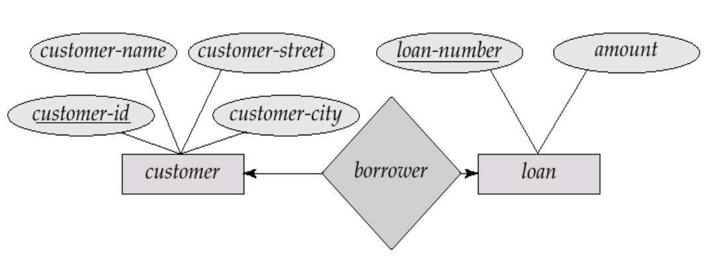
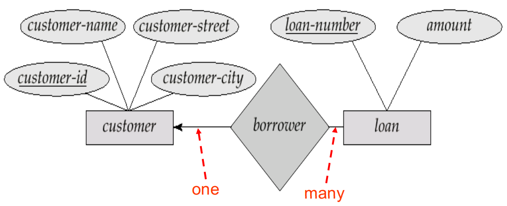
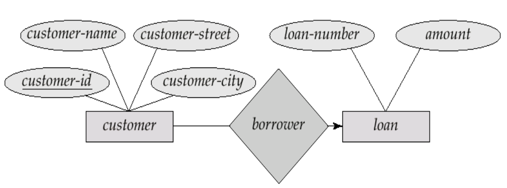
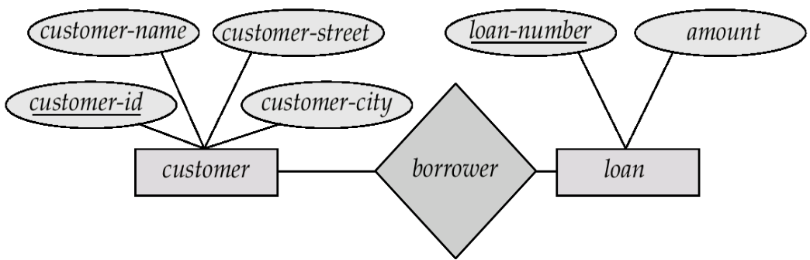
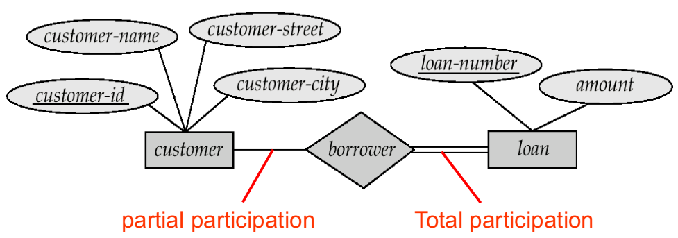
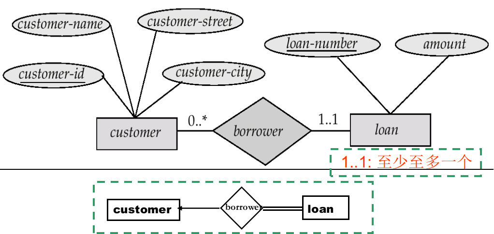
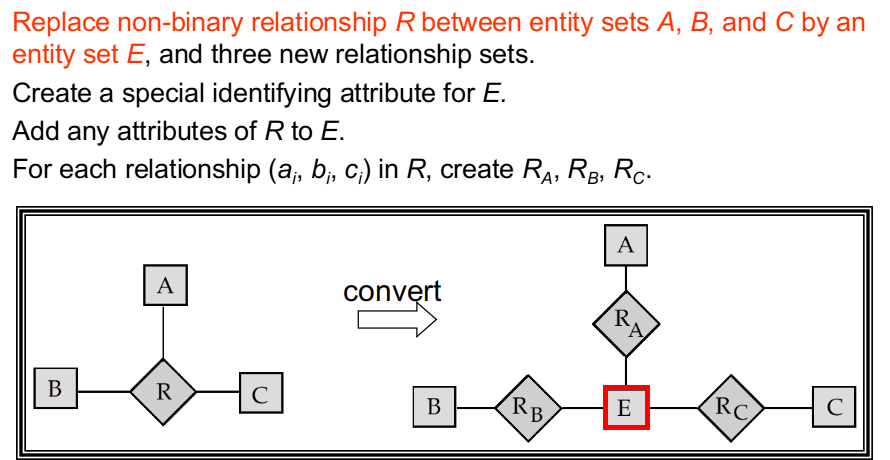

# WEEK 6

## 5 Entity-Relationship Model

### 5.1 Entity Sets

#### 5.1.1 Entity

- The real world  can be modeled as: 
  - A collection of **entities(实体)**
  - **Relationships(联系)** among entities 
- An **entity** is an object that exists and is distinguishable from other objects. --- **An entity may be concrete, or abstract**
- Entities have **attributes(属性)** 
- An **entity set** is a set of entities of the **same type** that **share the same properties**
  - 一个实体集包含多个同类实体 

#### 5.1.2 Attributes

- An entity is represented by a set of attributes, that is **descriptive properties** possessed by all members of an entity set.

- **Domain** (域, value set) –– the set of permitted values for each attribute.

- Attribute types:

  - **Simple** and **composite** attributes(简单和复合属性)

    - 复合属性可以再划分为更小的分量属性

      

  - **Single-valued** and **multi-valued** attributes(单值和多值属性)

  - **Derived** attributes(派生属性)

    - versus **base attributes** or **stored attributes** (基属性，存储属性)
    - 派生属性的值不存储，而是在需要时计算出来

### 5.2 Relationship Sets

#### 5.2.1 Relationship

- A relationship is an association among several entities (是二个或多个不同类实体之间的关联)

- A relationship set is a set of relationship of the same type
- An **attribute** can also be the **property of a relationship set**

#### 5.2.2 Degree of a Relationship Set

- Refers to the number of entity sets that participate in a relationship set
- Relationship sets that **involve two entity sets** are **binary** (or degree two)
- Relationship sets may **involve more than two entity sets**
- Relationships between more than two entity sets are rare. Most relationships are binary

#### 5.2.3 Mapping Cardinalities(映射基数)

- 一个实体通过一个联系集能关联的实体的个数
- Most useful in describing binary relationship sets
- For a **binary relationship set** the mapping cardinality must be one of the following types:
  - 一对一(one-to-one)
  - 一对多(one-to-many)
  - 多对一(many-to-one)
  - 多对多(many-to-many)

> Note : Some elements in entity set A and B may not be mapped to any elements in the other set. 

### 5.3 Keys

#### 5.3.1 Keys for Entity Sets

- A **super key** of an entity set is a set of one or more attributes whose values **uniquely determine each entity**
- A **candidate key** of an entity set is **a minimal super key**
- Although several candidate keys may exist, one of the candidate keys is selected to be the primary key

#### 5.3.2 Keys for Relationship Sets

- **The combination of primary keys** of the participating entity sets forms a **super key of a relationship set**(参与一个联系集的各实体集的码的组合，构成该联系集的超码)
- Must consider the mapping cardinality of the relationship set when deciding what are the candidate keys
- Need to consider semantics of relationship set in **selecting the primary key** in case of more than one candidate key
  - 作为码的属性不能为空，值不应常变

### 5.4 E-R Diagram

#### 5.4.1 基本结构

- E-R图的主要构件
  - Rectangles represent entity sets
  - Diamonds represent relationship sets
  - Lines link attributes to entity sets and entity sets to relationship sets
  - Ellipses represent attributes
    - Double ellipses represent multivalued attributes
    - Dashed ellipses denote derived attributes. 
  - Underline indicates primary key attributes

- Entity sets of a relationship need not be distinct
- **Role** is the function that an entity plays in a relationship
- Role labels are optional, and are used to clarify semantics of the relationship

#### 5.4.2 Express the Cardinality Constraints

- We express cardinality constraints by drawing either a **directed line** ($\rarr$), signifying “**one**”, or an **undirected line** (—), signifying “**many**”,  between the relationship set and the entity set

- One-To-One Relationship

  

- One-To-Many Relationship

  

- Many-To-One Relationship

  

- Many-To-Many Relationship

  

#### 5.4.3 Participation of an Entity Set in a Relationship Set

- **Total participation(全参与)**(indicated by double line): every entity in the entity set participates in at least one relationship in the relationship set
- **Partial participation(部分参与)**: some entities may not participate in any relationship in the relationship set
- 映射基数约束(Mapping cardinality constraints)，限定了一个实体与发生关联的另一端实体可能关联的数目上限
- 全参与和部分参与约束，则反映了一个实体参与关联的数目下限：0次，还是至少1次

#### 5.4.4 Alternative Notation for relationship Constraints

- Alternative notation for **cardinality constraints** and **participation constraints**

#### 5.4.5 Binary and Non-Binary Relationships

- Some relationships that appear to be non-binary may be better represented using binary relationships
- Using two binary relationships allows partial information
- There are some relationships that are naturally non-binary
- In general, any non-binary relationship can be represented using binary relationships by creating an **artificial entity set**

#### 5.4.6 Weak Entity Sets

- An entity set that does not have a primary key is referred to as a **weak entity set**
- The existence of a weak entity set **depends on** the existence of a identifying entity set  or owner entity set (标识实体集或属主实体集)
  - It must relate to the identifying entity set via a **total, one-to-many relationship set** from the identifying to the weak entity set
- The related relationship is called identifying relationship(标识性联系)
- The **discriminator** or **partial key**(分辨符或部分码) of a weak entity set is the set of attributes that distinguishes among all those entities in a weak entity set that depend on one particular strong entity
- The **primary key of a weak entity set** is formed by the **primary key of the strong entity set** on which the weak entity set is existence dependent, **plus the weak entity set’s discriminator**

> Note: The primary key of the strong entity set is **not explicitly stored with the weak entity set**, since it is implicit in the identifying relationship. 

### 5.5 Extended E-R Features

#### 5.5.1 Specialization(特殊化、具体化) 

- 在实体集内部进行分组的过程称为特化

- **Top-down design process** – we designate subgroupings within an entity set that are distinctive from other entities in the set
- These subgroupings become lower-level entity sets that have attributes or participate in relationships that do not apply to the higher-level entity set
- Attribute inheritance – a lower-level entity set inherits all the attributes and relationship participation of the higher-level entity set to which it is linked
- 若一个实体集允许属于多个特化实体集称为**重叠特化**
- 若一个实体集必须属于至多一个特化实体集称为**不相交特化**

#### 5.5.2 Generalization(泛化、普遍化) 

- A **bottom-up design process** – combine a number of entity sets that share the same features into a higher-level entity set
- Specialization and generalization are simple inversions of each other; they are represented in an E-R diagram in the same way
- The terms specialization and generalization are used interchangeably

#### 5.5.3 Design Constraints on a Specialization / Generalization

- Constraint on which entities can be members of a given lower-level entity set
  - Condition-defined(条件定义的) 
  - User-defined
- Constraint on whether or not entities may belong to more than one lower-level entity set within a single generalization
  - Disjoint(不相交)
    - An entity can belong to only one lower-level entity set
    - Noted in E-R diagram by writing disjoint next to the ISA triangle
  - Overlapping(可重叠)
    - An entity can belong to more than one lower-level entity set
- Completeness constraint (完全性约束) -- specifies whether or not an entity in the higher-level entity set must belong to at least one of the lower-level entity sets within a generalization
  - Total: an entity must belong to one of the lower-level entity sets
  - Partial: an entity need not belong to one of the lower-level entity sets

#### 5.5.4 Aggregation

### 5.6 Design of an E-R Database Schema

### 5.7 Reduction of an E-R Schema to Tables